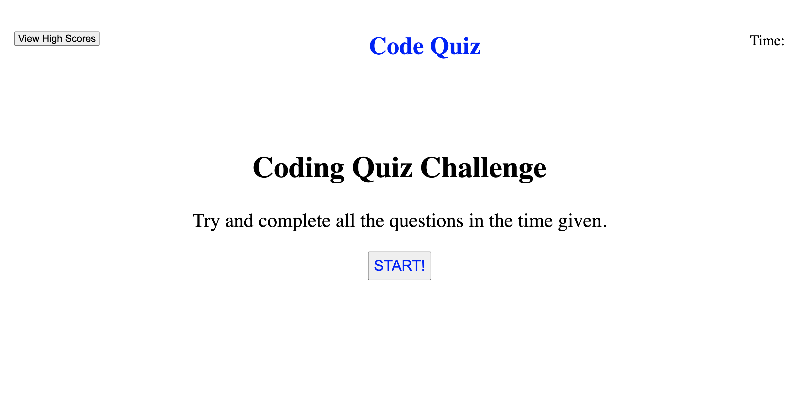

# code-quiz
## Project by Jaydon Goodrich

## Purpose
The Purpose of this project is present a timed coding quiz that will save your score

## Objectives
* Display 10 questions for the user to answer
* Set a timer to countdown from 90 seconds
* if a user misses a question 10 seconds will be subtracted
* once the quiz is over users are presented with their score and can save their initials to localStorage

All code was written by me Jaydon Goodrich.
Questions for the quiz were my own as well as some questions came from http://mcqspdfs.blogspot.com/2013/08/60-top-javascript-multiple-choice.html

The site is deployed at https://https://jaydon-goodrich.github.io/code-quiz/

